# 🍽️ Swiftab App

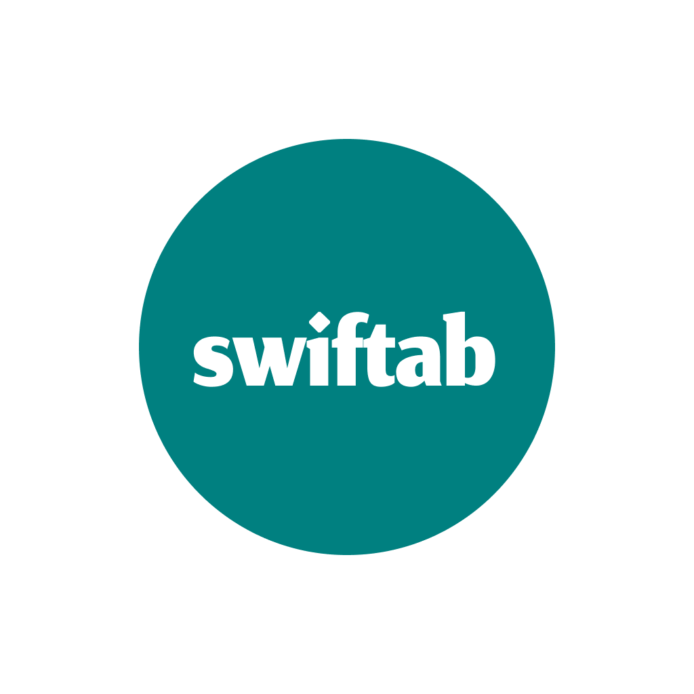

## 📌 Overview
**Swiftab App** is a mobile application designed to simplify restaurant reservations. It enables users to:  
- Discover and browse nearby restaurants  
- View menus using QR codes  
- Reserve tables with ease  
- Manage reservations efficiently  

---

---

## 🖼️ Screenshots

<p align="center">
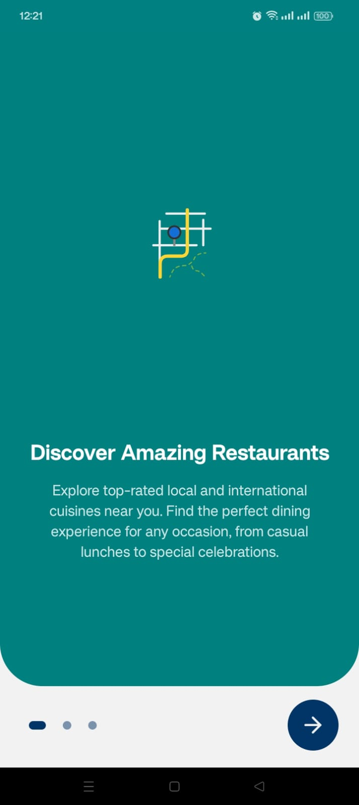
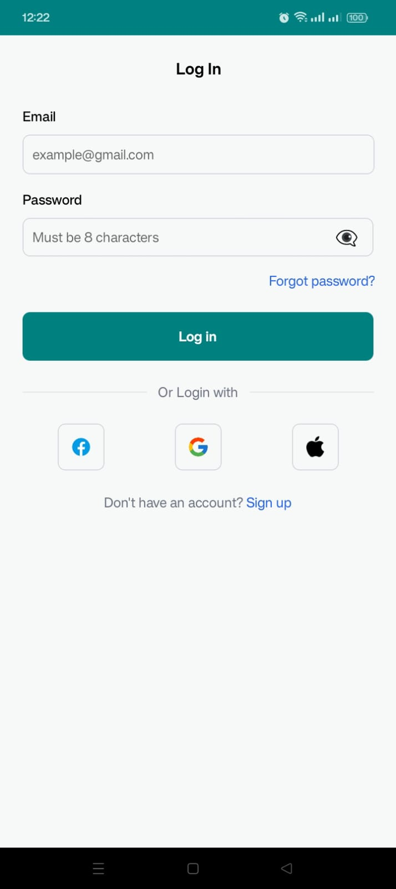
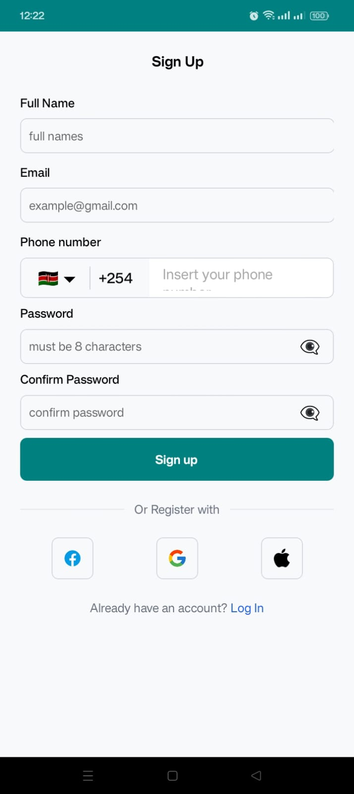
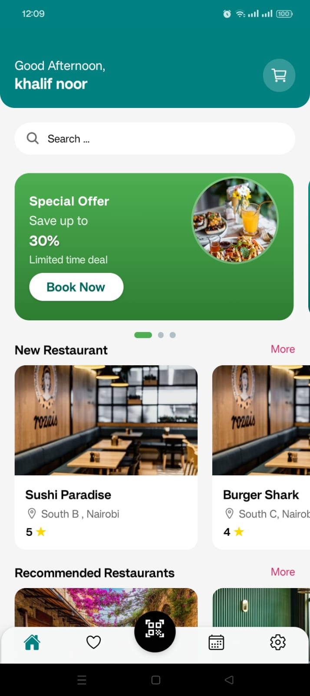
  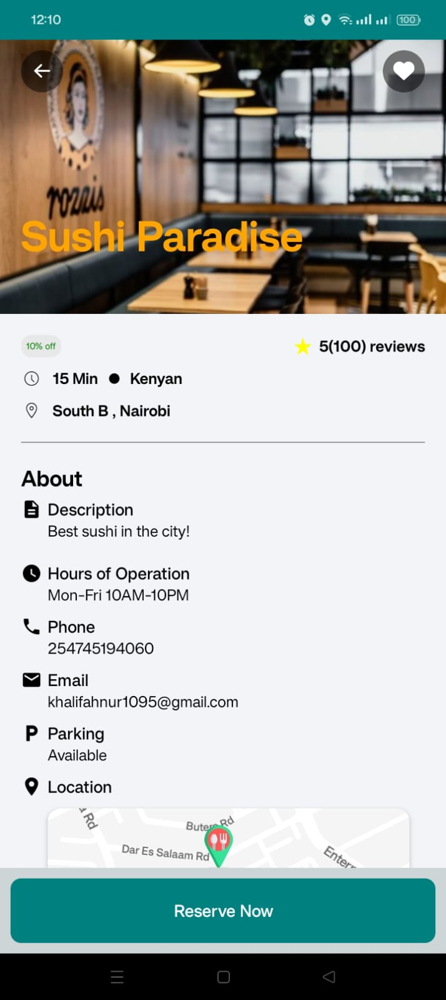
  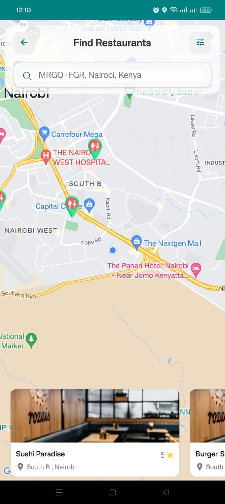
  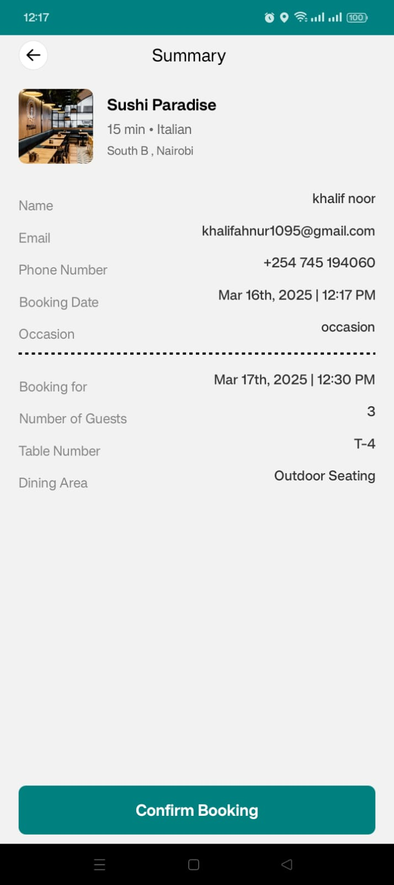
  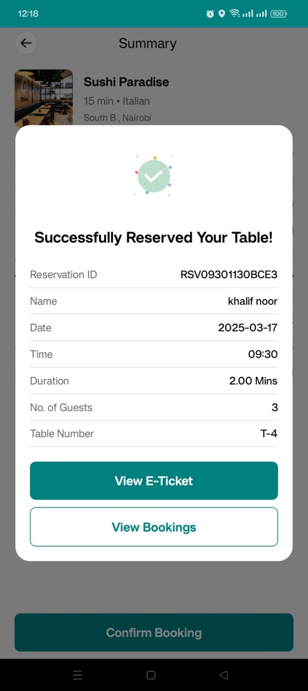
  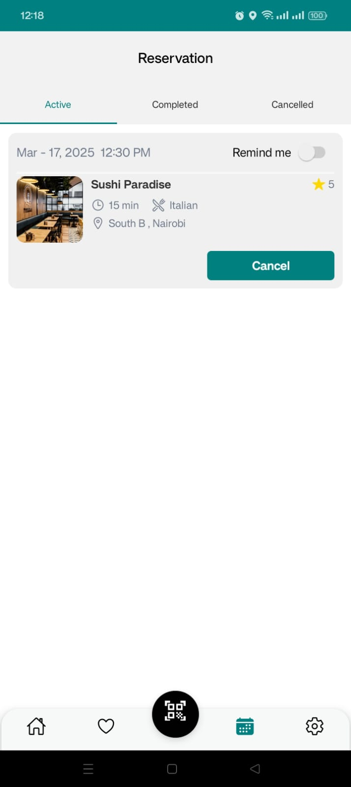
  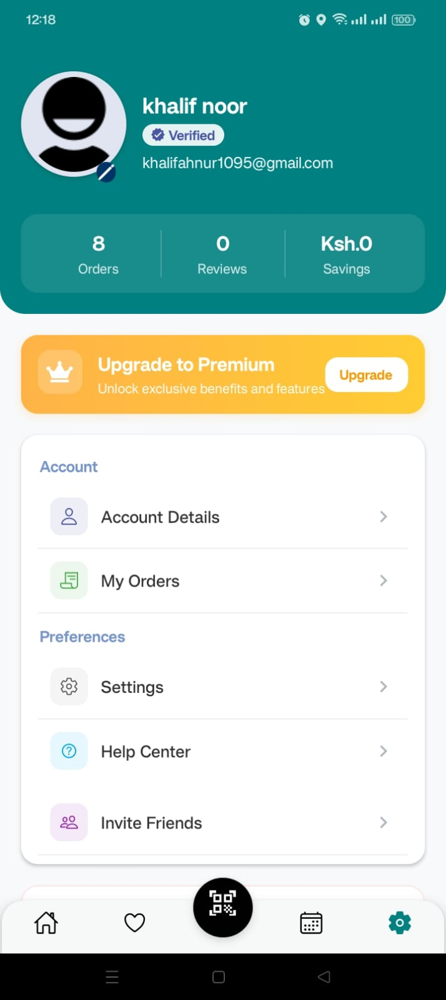
  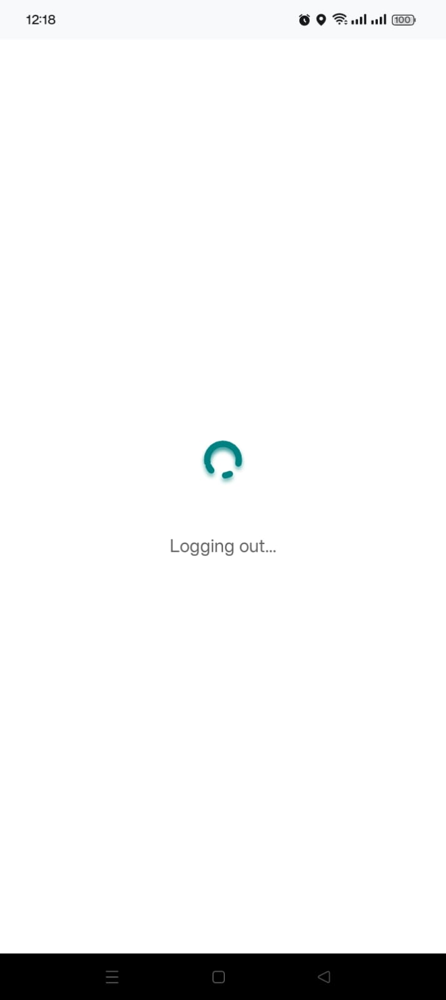
</p>

---

## 📖 Table of Contents

- [📌 Overview](#-overview)
- [✨ Features](#-features)
- [🛠️ Technologies Used](#-technologies-used)
- [🚀 Installation](#-installation)
- [📖 Usage Guide](#-usage-guide)
- [🔗 API Endpoints](#-api-endpoints)
- [🤝 Contribution](#-contribution)
- [📜 License](#-license)
- [📧 Contact](#-contact)

---

## ✨ Features

- 🔍 **Find Nearby Restaurants** – Browse restaurants based on location.
- 📄 **View Restaurant Menus** – Scan QR codes to access menus instantly.
- 🛒 **Add Items to Cart** – Select menu items for convenient ordering.
- 📅 **Table Reservation** – Check availability and book tables effortlessly.
- ✅ **Manage Reservations** – Keep track of active, cancelled, and completed bookings.
- 🔗 **QR Code Generation** – Generate QR codes for quick menu access.
- 🔔 **Real-Time Notifications** – Receive instant updates on reservation status.

---

## 🛠️ Technologies Used

- **Frontend:** React Native (Expo)
- **Backend:** Node.js & Express
- **Database:** MongoDB Atlas
- **APIs & Services:**
  - Google Maps API (for restaurant discovery)
  - WebSockets (for real-time reservation updates)

---

## 🚀 Installation

1. **Clone the repository:**
   ```sh
   git clone https://github.com/yourusername/swiftab-app.git
   ```
2. **Navigate to the project directory:**
   ```sh
   cd swiftab-app
   ```
3. **Install dependencies:**
   ```sh
   npm install
   ```
4. **Start the Expo development server:**
   ```sh
   expo start
   ```

---

## 📖 Usage Guide

1. **Sign up or log in** to access the app.
2. Use the **Nearby Restaurants** feature to find dining places.
3. **Scan QR codes** to view restaurant menus instantly.
4. **Add menu items to your cart** and proceed with table reservations.
5. **Monitor your reservation status** (Active, Cancelled, Completed).

---

## 🔗 API Endpoints

| Method     | Endpoint              | Description                             |
| ---------- | --------------------- | --------------------------------------- |
| **GET**    | `/restaurants`        | Fetch nearby restaurants                |
| **GET**    | `/menu/:restaurantId` | Retrieve menu for a specific restaurant |
| **POST**   | `/reserve`            | Create a new reservation                |
| **GET**    | `/reservations`       | Get user reservation details            |
| **DELETE** | `/reservations/:id`   | Cancel a reservation                    |

## 🤝 Contribution

We welcome contributions! To contribute:

1. **Fork the repository**
2. **Create a new branch** (`feature-branch`)
3. **Commit your changes and push them**
4. **Open a pull request** with a description of your changes

---

## 📜 License

This project is licensed under the **MIT License**.

---

## 📧 Contact

For inquiries or support, reach out via email:  
✉️ [khalifahnur1095@gmail.com]
